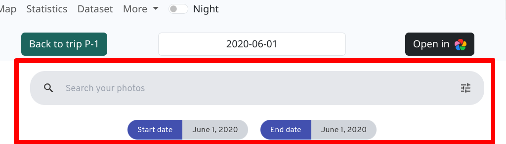

# Immich Integration

## Hide Immich search bar
> [!TIP]
> When Immer in Bewegung embeds photos in **image view** (see below), the search bar from Immich will be displayed unless you use small a css modification in your Immich settings.

Add
```
body:has(#search-chips:target) #asset-selection-app-bar,
body:has(#search-chips:target) #search-chips {
  display:none;
}
```
to **User Icon** > **Admininstration** > **Settings** > **Theme Settings**: Custom CSS.



## Usage of Immich API
To make use of Immich API you need to allow CORS, example snippet to add to **/etc/caddy/Caddyfile**

```
(cors) {
        @cors_preflight{args[0]} method OPTIONS
        @cors{args[0]} header Origin {args[0]}

        handle @cors_preflight{args[0]} {
                header {
                        Access-Control-Allow-Origin "{args[0]}"
                        Access-Control-Allow-Methods "GET, POST, PUT, PATCH, DELETE, OPTIONS"
                        Access-Control-Allow-Headers *
                        Access-Control-Max-Age "3600"
                        defer
                }
                respond "" 204
        }

        handle @cors{args[0]} {
                header {
                        Access-Control-Allow-Origin "{args[0]}"
                        Access-Control-Expose-Headers *
                        defer
                }
        }
}

immich.your-server-name.dedyn.io {

        # Needed for API call
        import cors https://immich.your-server-name.dedyn.io

        # Needed for iframe embedding
        header {
                Cross-Origin-Embedder-Policy require-corp
                Cross-Origin-Resource-Policy cross-origin
        }

        @options method OPTIONS
        respond @options 204

        reverse_proxy http://localhost:2283

}
```
